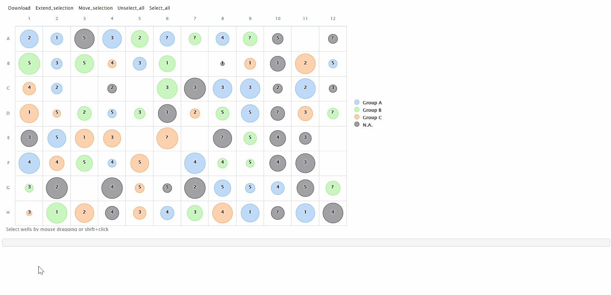

# layoutPlateMod
A shiny module for plotting microplate layout

### Introduction

This is a highcharter package based shiny module that can display the layout of a microplate as bubble plot and return infomation of user selected wells.


### Pre-request

This shiny module requires following packages. Please make sure they are installed.

```r
install.package('dplyr')
install.package('tidyr')
install.package('highcharter')
```

### Usage

1. Source the module file

  ```r
  source('layoutPlateMod.R')
  ```
  
2. In server function, create a shiny reactive object that contains the microplate layout data to be displayed in dataframe format: 

  ```r
  server <- function(input, output) {

    # The microplate dataframe should contain at least four columns:
    #   Well(chr): the well id of microplate (eg, A1, A2, B5, D12) 
    #   Value(num): the value of that well to be displayed as bubble size
    #   Color_by(chr): the categorical variable that defines the color of bubble
    #   Label(chr): the label displayed on the bubble
    # The dataframe may contain other columns and will be ignored.
    
    microplate <- reactive({
      expand.grid(Row = LETTERS[1:8], Col = 1:12, stringsAsFactors = F) %>%
        unite(Well, Row, Col, sep = '') %>%
        mutate(Value = runif(n()),
               Color_by = sample(c('Group A', 'Group B', 'Group C', NA_character_), n(), T),
               Label = sample(c(1:5, NA), n(), T)) %>%
        sample_frac(0.9) %>%
        arrange(Color_by)
    })
  
    # other codes

  }
  ```

3. Invoke module in server function and send the microplate data object to the `data` parameter. Set `nrow` and `ncol` to define the type of microplate:

  ```r
  selected <- callModule(loplate, id = 'YOU_MODULE_ID', data = microplate, nrow = 8, ncol = 12)
  ```

4. Add layout output ui

  ```r
  ui <- fluidPage(

    loplateUI('YOU_MODULE_ID')

  )
  ```

5. Run app. Select wells by Click + Dragging or Shift + Click. The module returns a subsetted dataframe according to the selection.


